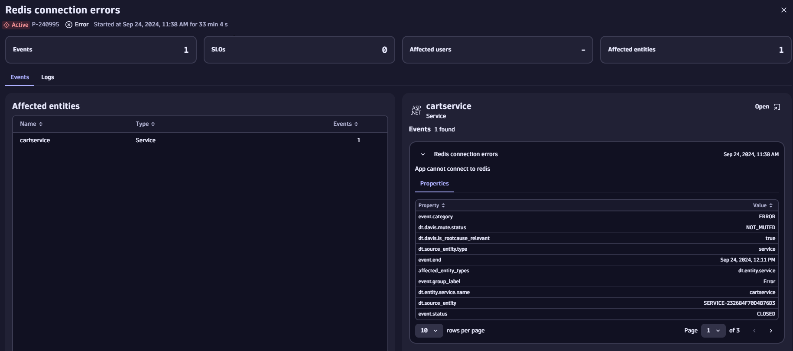

# Observability Lab: Using Dynatrace to Detect Problems in Logs

Watch the full companion video on YouTube:
 

In this hands-on demo, you will send logs from the OpenTelemetry demo application to Dynatrace.

You will artificially create a problem in the application which Dynatrace Intelligence will detect and thus raise a problem report based on the Observability data.

The logs include span and trace IDs meaning you will be easily able to drill between signal types to see logs in the context of the distributed trace and vice versa.

## [Start the hands-on here >>](https://dynatrace.github.io/obslab-log-problem-detection)

## Local Dev Container Setup

This repository uses a feature-based Dev Container on `ubuntu:noble`, aligned to the `obslab-otel-collector-data-ingest` setup pattern.

Prerequisites:
- Docker Desktop or compatible Docker engine
- VS Code with Dev Containers extension

Recommended Dev Container secrets:
- `DT_ENV_ID_OBSLAB_LOG_PROBLEM_DETECTION`
- `DT_ENV_OBSLAB_LOG_PROBLEM_DETECTION` (`live`, `sprint`, or `dev`; defaults to `live`)
- `DT_API_TOKEN_OBSLAB_LOG_PROBLEM_DETECTION`
- `DT_NOTEBOOK_ID_LOG_PROBLEM_DETECTION`

When the container is created, `environment_installer.py` will:
- install Python requirements
- create a local Kind cluster
- configure Helm repositories
- deploy the collector and OpenTelemetry demo

When attaching/re-attaching to the container, `on_attach.py` refreshes kubeconfig connectivity to the Kind control-plane.

Tooling is provisioned by Dev Container features (Docker-in-Docker, Kind, kubectl, Helm, Python, and GitHub CLI).
