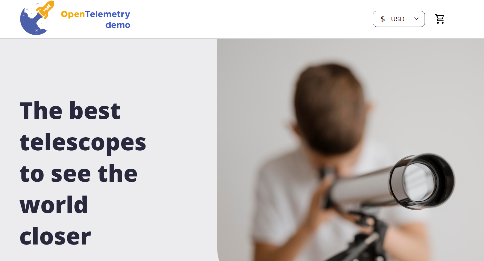

## Access The Demo User Interface

!!! tip
    This step is optional because there is a load generator already running. Observability data will be flowing into Dynatrace.

Expose the user interface on port 8080 by port-forwarding:

```
kubectl -n default port-forward svc/my-otel-demo-frontendproxy 8080:8080
```

Go to the `Ports` tab, right click the port `8080` and choose `Open in Browser`.

You should see the OpenTelemetry demo application.



<div class="grid cards" markdown>
- [Click Here to Continue :octicons-arrow-right-24:](view-observability-data.md)
</div>