# Getting Started

--8<-- "snippets/bizevent-getting-started.js"

## Dynatrace Environment

You must have access to a Dynatrace SaaS environment.[Sign up here](https://dt-url.net/trial){target="_blank"}

Save the Dynatrace environment URL:

* Without the trailing slash
* Without `.apps.` in the URL

The generic format is:

```
https://<EnvironmentID>.<Environment>.<URL>
```

For example:
```
https://abc12345.live.dynatrace.com
```

## Custom Runbook

!!! info
    As the developer responsible for the cartservice, if problems occur, you're the best person to know how to resolve the issue.

    To help your colleagues, you have prebuilt a notebook which will be useful as a runbook if / when problems occur.

    You want to make this notebook automatically available whenever problems with the `cartservice` occur.

Download the file [Redis Troubleshooting.json](https://github.com/Dynatrace/obslab-log-problem-detection/blob/main/dynatrace/Redis%20Troubleshooting.json) and save to your computer.

In Dynatrace:

* Press `ctrl + k`. Search for `notebooks`
* Open the app and find the `Upload` button at the top of the page
* Upload the JSON file you previously downloaded

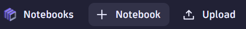

* Make a note of the notebook ID from the URL bar

!!! warning
    Your environment and notebook IDs will be different.

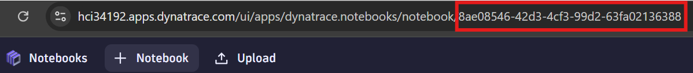

## Install New Problems App

In Dynatrace:

* Press `ctrl + k`. Search for `Hub`.
* Open the `Problems` app and click `Install`

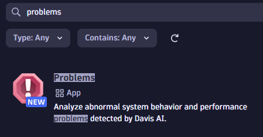

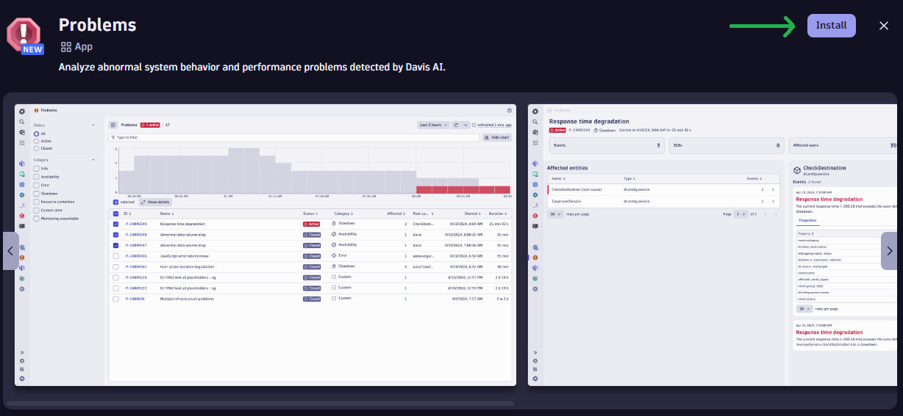

## Create OpenPipeline

### Define New Log Pipeline

In Dynatrace:

* Press `ctrl + k`. Search for `OpenPipeline`. Open the app
* Ensure `Logs` is selected and select the `Pipelines` tab


* Click `+ Pipeline` to create a new log ingest pipeline.
* Click the pencil icon and rename the pipeline to `Log Errors`
* Change to the `Data extraction` tab and add a new `Davis event` processor

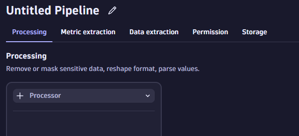
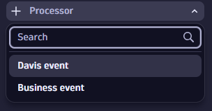

* Provide any name you like
* Set the `Matching condition` to `true` (this means any log line flowing through the pipeline will alert)
* Set the `Event name` to:

```
[{priority}][{deployment.release_stage}][{deployment.release_product}][{dt.owner}] {alertmessage}
```

* Set the `Event description` to:

```
{supportInfo} - Log line: {content}
```

* Set the `event.type` property to:

```
ERROR_EVENT
```

* Add 5 new properties:

    * `dt.owner` with value: `{dt.owner}`
    * `dt.cost.costcenter` with value: `{dt.cost.costcenter}`
    * `dt.cost.product` with value: `{dt.cost.product}`
    * `deployment.release_product` with value: `{deployment.release_product}`
    * `deployment.release_stage` with value: `{deployment.release_stage}`

!!! warning "Save it!"
    Don't forget to click `Save` to save the pipeline

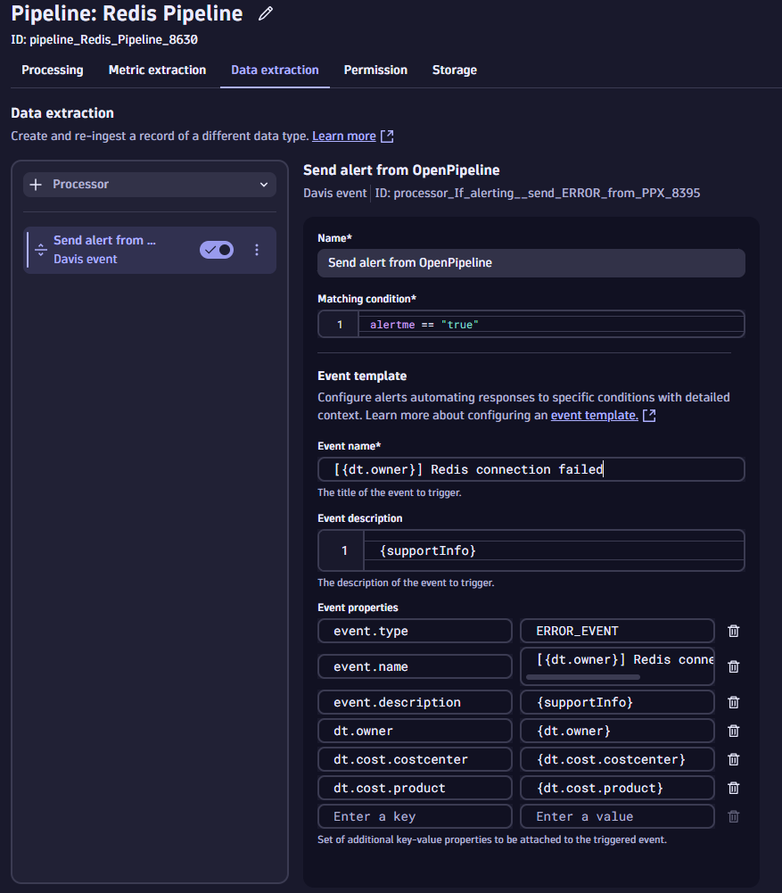

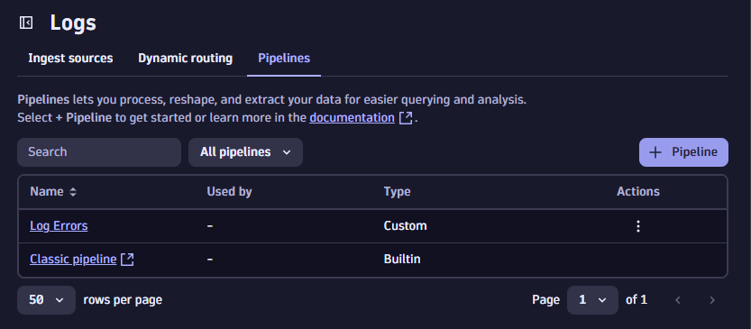

### Create Pipeline Routing Rule

Create a dynamic routing rule to tell Dynatrace to redirect only certain logs through the Logs Errors pipeline.

* Switch to the `Dynamic routing` tab
* Click `+ Dynamic route`
* Name the route whatever you like
* Set the `Matching condition` to:

```
isNotNull(alertmessage) and
isNotNull(priority) and
priority == "1"
```

* Click `Add`

!!! warning "Save it!"
    Don't forget to click `Save` to save the dynamic route

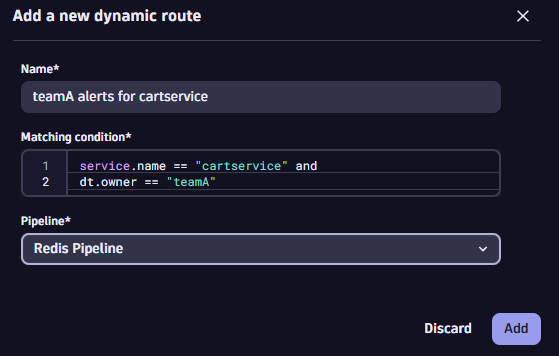
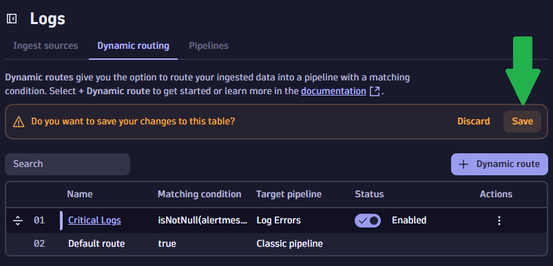

!!! success
    The pipeline is configured.

    Logs flowing into Dynatrace with an `alertmessage` field and a priority of `"1"` will be processed
    via your custom pipeline.

    Those log lines will raise a custom problem in Dynatrace
    where the problem title is:

    `[{priority}][{deployment.release_stage}][{deployment.release_product}][{dt.owner}] {alertmessage}`

### Explain the Configuration

The above needs some explanation because there's a lot of "magic" happening.

This will be explained after the demo is started; while you wait for things to initialise.

## Create API Token

In Dynatrace:

* Press `ctrl + k`. Search for `access tokens`.
* Create a new access token with the following permissions:
    * `logs.ingest`
    * `metrics.ingest`
    * `openTelemetryTrace.ingest`
    * `events.ingest`

#### API Token Permissions Explained
* `logs.ingest`, `metrics.ingest` and `openTelemetryTrace.ingest` are required to send the relevant telemetry data into Dynatrace
* `events.ingest` is required to send the `CUSTOM_CONFIGURATION` event into Dynatrace

## Start Demo

--8<-- "snippets/codespace-details-warning-box.md"

You've done the hard work! It is time to spin up the demo environment.

Click this button to open the demo environment. This will open in a new tab.

[](https://codespaces.new/dynatrace/obslab-log-problem-detection){target="_blank"}

* Fill in the form with the details you've already gathered.
* Click `Create codespace`
* Proceed to the next documentation step with the link below.

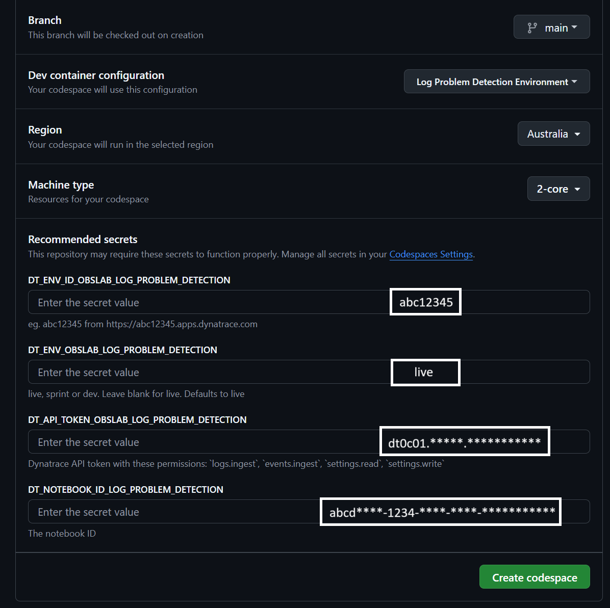


<div class="grid cards" markdown>
- [Click Here to Continue :octicons-arrow-right-24:](installation-explained.md)
</div>