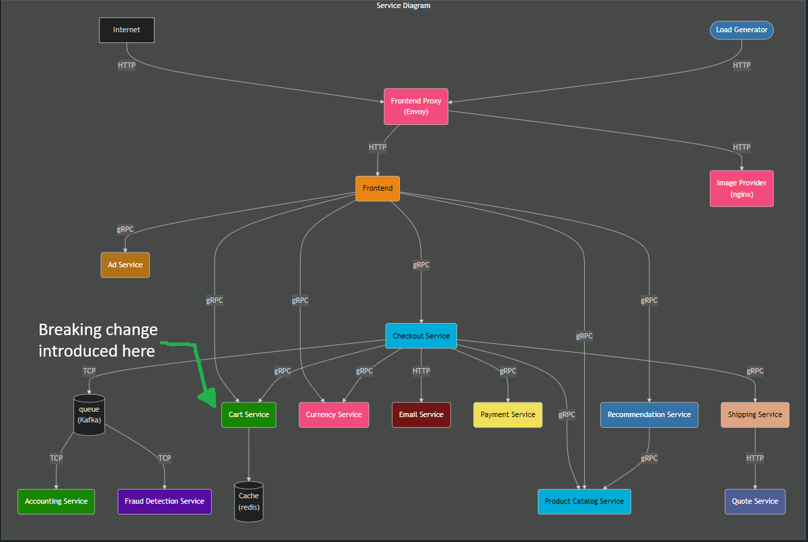

# Using Dynatrace to Detect Problems in Logs

--8<-- "snippets/disclaimer.md"
--8<-- "snippets/view-code.md"
--8<-- "snippets/overview-video.md"
--8<-- "snippets/bizevent-homepage.js"

In this hands-on demo, you will send logs from the OpenTelemetry demo application to Dynatrace.

You will artificially create a problem in the application which [Dynatrace DAVIS](https://www.dynatrace.com/platform/artificial-intelligence/){target=_blank} will detect and thus raise a problem report based on the Observability data.

The logs include span and trace IDs meaning you will be easily able to drill between signal types to see logs in the context of the distributed trace and vice versa.

!!! tip
    Right click and "open image in new tab"
    to see large image

## How is the problem created?
You will release a new feature into production. For demo purposes, this new feature intentionally introduces failure into the system.

First you will inform Dynatrace that a change is incoming. This will be done by sending a `CUSTOM_CONFIGURATION` event to Dynatrace.
Then the feature will be enabled by toggling a feature flag.

After a few moments, the error will occur. The `ERROR` logs flowing into Dynatrace will trigger the problem.

This demo uses the [OpenTelemetry demo application](https://opentelemetry.io/docs/demo){target=_blank} and the [Dynatrace OpenTelemetry collector distribution](https://docs.dynatrace.com/docs/extend-dynatrace/opentelemetry/collector){target=_blank} ([why might I want to use the Dynatrace OTEL Collector?](resources.md#why-would-i-use-the-dynatrace-otel-collector){target=_blank}).

## Logical Flow

- [Click Here to Begin :octicons-arrow-right-24:](getting-started.md)

