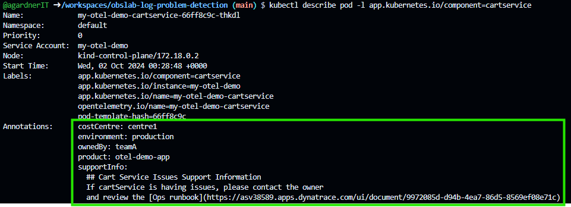
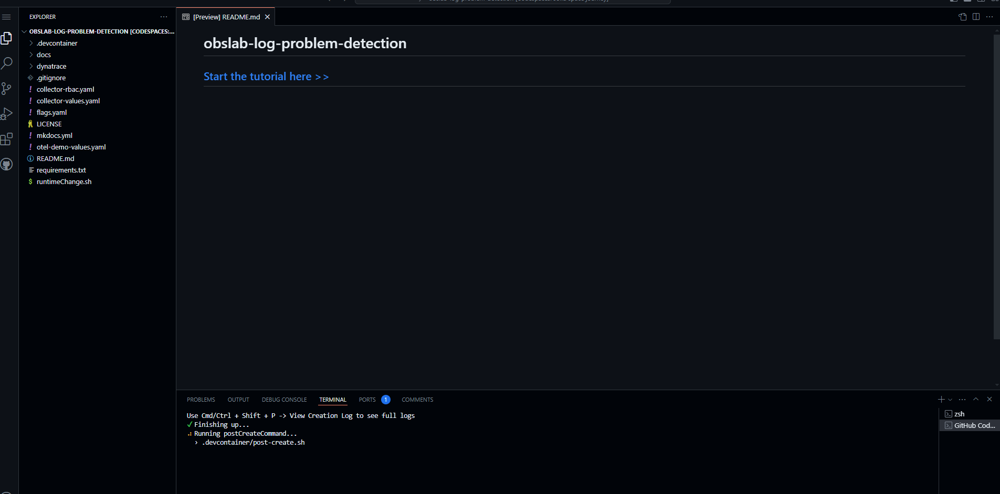
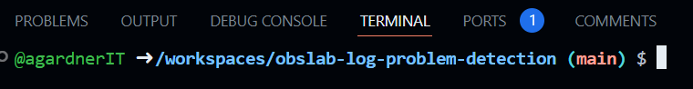

## Hurry up and wait

!!! warning "Grab a Coffee"
    Everything is installing. This can take a while.

    While you wait, the section below will explain what you've just configured and how it works.

The OpenTelemetry demo and the Dynatrace collector will be installed automatically.

The Dynatrace details you provided during startup will be encrypted, stored in GitHub secrets and made available as environment variables.

They will also be stored in a Kubernetes secret `dynatrace-otelcol-dt-api-credentials`

!!! tip
    Type `printenv` to see all environment variables
    set by GitHub.

## Explain the Configuration

!!! tip "OpenTelemetry Experts Need Not Apply"
    If you already understand OpenTelemetry, the collector, OTTL
    and are comfortable reading the collector configuration file,
    you can probably skip this section.

The pipeline setup in the previous section contained references to lots of fields such as `priority`, `alertmessage` and `dt.owner`.

How did all of those fields get there? Remember, this demo does not modify any of the application code.

### 1. Pod Annotations

First, the developer adds additional, custom annotations to the microservice they are interested in. In this case, the `cartservice`.

They do this by adding some Key/Value pairs to the `podAnnotations` (see [otel-demo-values.yaml](https://github.com/Dynatrace/obslab-log-problem-detection/blob/6314352aaeefc489d8d0096b787a981c81831f59/otel-demo-values.yaml#L20){target=_blank}).

During initialisation, the codespace replaces the placeholder text with your tenant details and notebook ID (see [post-create.sh](https://github.com/Dynatrace/obslab-log-problem-detection/blob/6314352aaeefc489d8d0096b787a981c81831f59/.devcontainer/post-create.sh#L38){target=_blank}).

It is important to realise that the developer is in full control of these K/V pairs.
They can add as many or few as they wish.

You can see these annotations with this command:

```
kubectl describe pod -l app.kubernetes.io/component=cartservice
```



### 2. Collector Enriches Logs

Logs are [sent out of the cartservice via OpenTelemetry Protocol (OTLP)](https://opentelemetry.io/docs/demo/services/cart/#logs){target=_blank} to the collector.

As log lines flow [through the collector pipeline](https://github.com/Dynatrace/obslab-log-problem-detection/blob/main/collector-values.yaml#L148){target=_blank},
the logs are processed by two `processors`: The [k8sattributes](https://github.com/open-telemetry/opentelemetry-collector-contrib/blob/main/processor/k8sattributesprocessor){target=_blank} and [transform](https://github.com/open-telemetry/opentelemetry-collector-contrib/tree/main/processor/transformprocessor){target=_blank} processors.

### k8sattributes Processor

The [k8sattributes](https://github.com/open-telemetry/opentelemetry-collector-contrib/blob/main/processor/k8sattributesprocessor){target=_blank} interacts with the Kubernetes API to extract important k8s metadata such as pod names, deployment names, node names and other topology-relevant information.

This processor also [pulls selected annotations from pods](https://github.com/Dynatrace/obslab-log-problem-detection/blob/6314352aaeefc489d8d0096b787a981c81831f59/collector-values.yaml#L49){target=_blank}. Namely, the custom annotations that were set in step one.

!!! info
    Notice also that the `key`s are renamed in realtime to Dynatrace-relevant keys. (eg. `ownedBy` becomes `dt.owner`).

All of this information: the k8s metadata and custom annotations are dynamically added to each log line and span as it flows through the collector.
 
Thus this log line:
 
```
2024-10-01 10:00:00 INFO A log message
```

May become:

```
2024-10-01 10:00:00 INFO A log message dt.owner=Susan k8s.pod-name=cart-service-abc1234 ...
```

### transform Processor

The [transform](https://github.com/open-telemetry/opentelemetry-collector-contrib/tree/main/processor/transformprocessor){target=_blank} processor modifies the telemetry (eg. log line content and attributes) based on the [OpenTelemetry Transformation Language](https://github.com/open-telemetry/opentelemetry-collector-contrib/tree/main/pkg/ottl){target=_blank}.

The collector creates new dynatrace-relevant attributes based on existing attributes. [For example](https://github.com/Dynatrace/obslab-log-problem-detection/blob/6314352aaeefc489d8d0096b787a981c81831f59/collector-values.yaml#L106){target=_blank}, taking `k8s.deployment.name` and creating a new attribute called `dt.kubernetes.workload.name` with the same value.

Two brand new attributes `alertmessage` and `priority` are dynamically added (see [here](https://github.com/Dynatrace/obslab-log-problem-detection/blob/6314352aaeefc489d8d0096b787a981c81831f59/collector-values.yaml#L123){target=_blank}) based on conditions we specify.

* `alertmessage` is intended as a place for the developer to indicate a human readable alert message.
* `priority` is intended as a place for the developer to indicate the importance of this error.

```
- set(attributes["alertmessage"], "Critical Redis connection error!")
  where resource.attributes["service.name"] == "cartservice"
  and resource.attributes["deployment.release_stage"] == "production"
  and IsMatch(body, "(?i)wasn't able to connect to redis.*")

- set(attributes["priority"], "1")
  where resource.attributes["service.name"] == "cartservice"
  and resource.attributes["deployment.release_stage"] == "production"
  and IsMatch(body, "(?i)wasn't able to connect to redis.*")
```

!!! success "OpenPipeline Integration"
    The previous steps demonstrate how the logs are enriched with additional metadata.

    OpenPipeline can then use these fields as logs flow into Dynatrace.

## Wait for System

The system may still be loading.

Wait until the `Running postCreate command` loading spinner disappears.



Wait here until the terminal prompt looks like this (your username will differ).



## Wait for Application

The Kubernetes cluster is available and the application is starting.

Wait for all pods to be Ready (can take up to 10mins)

```
kubectl wait --for condition=Ready pod --timeout=10m --all
```

The command will appear to hang until all pods are available.

When all pods are running, the output will look like this:

```
pod/dynatrace-collector-opentelemetry-collector-******-**** condition met
pod/my-otel-demo-accountingservice-******-**** condition met
pod/my-otel-demo-adservice-******-**** condition met
pod/my-otel-demo-cartservice-******-**** condition met
pod/my-otel-demo-checkoutservice-******-**** condition met
pod/my-otel-demo-currencyservice-******-**** condition met
pod/my-otel-demo-emailservice-******-**** condition met
pod/my-otel-demo-flagd-******-**** condition met
pod/my-otel-demo-frauddetectionservice-******-**** condition met
pod/my-otel-demo-frontend-******-**** condition met
pod/my-otel-demo-frontendproxy-******-**** condition met
pod/my-otel-demo-imageprovider-******-**** condition met
pod/my-otel-demo-kafka-******-**** condition met
pod/my-otel-demo-loadgenerator-******-**** condition met
pod/my-otel-demo-paymentservice-******-**** condition met
pod/my-otel-demo-productcatalogservice-******-**** condition met
pod/my-otel-demo-prometheus-server-******-**** condition met
pod/my-otel-demo-quoteservice-******-**** condition met
pod/my-otel-demo-recommendationservice-******-**** condition met
pod/my-otel-demo-shippingservice-******-**** condition met
pod/my-otel-demo-valkey-******-**** condition met
```

<div class="grid cards" markdown>
- [Click Here to Continue :octicons-arrow-right-24:](access-ui.md)
</div>