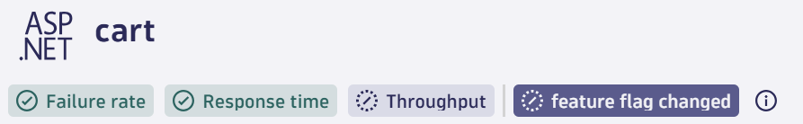
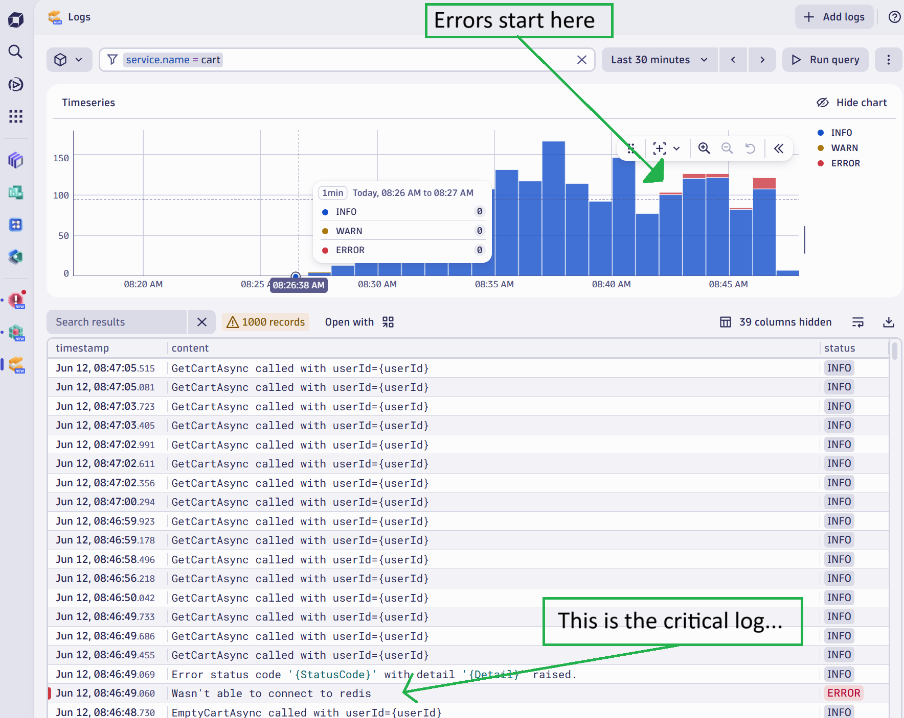
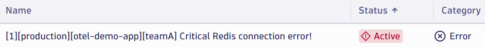

--8<-- "snippets/bizevent-introduce-system-change.js"

The application is running correctly. It is time to introduce a change into the system.

This simulates releasing new functionality to your users in production.

## Inform Dynatrace

First, inform Dynatrace that a change is about to occur.
Namely, you are going to make a change to the `cart` service 
by changing the `cartFailure` feature flag from `off` to `on`.

Tell Dynatrace about the upcoming change by sending an event (note: This event does **not** actually make the change; you will do this manually in the following step).

Run the following:

```
./runtimeChange.sh cart cartFailure on
```

You should see this event appear on the `cart` service screen:



## Make Change

Open this file: `flags.yaml`

Change the `defaultValue` of `cartFailure` from `"off"` to `"on"` (scroll to line `69`)


Now apply the change by running this command:

```
kubectl apply -f $CODESPACE_VSCODE_FOLDER/flags.yaml
```

You should see:

```
configmap/flagd-config configured
```

## Restart Flagd

Normally flagd can detect changes to files in realtime, but in some environments (due to the underlying operating system's ability to watch and notify on file changes) this sometimes does not work as intended.

To be sure that the new value of `off` is used, restart flagd now:

```
kubectl scale deploy flagd --replicas=0
```

Wait until the `flagd` pod disappears from the list when you run this command (in our resource constrained environment this take 30s - 1min). Re-run the `get pods` command until you see it disappear:

```
kubectl get pods
```

Now scale flagd back up:

```
kubectl scale deploy flagd --replicas=1
```

!!! warning "Be Patient"
    The application will now generate errors when emptying the users cart.
    It will do this 1/10th of the time, so be patient, it can take a few moments for the errors to occur.

## Generate Your Own Traffic

There is a load generator running, but you can generate traffic by accessing the site.

See [access user interface](access-ui.md){target=_blank}

Repeatedly add an item to your cart, go to the cart and empty it. Hope you're "lucky" that you generate a backend failure.

## Wait for Error Logs

Use the Logs app and wait until you see `ERROR` logs appear.



## Open Problems App

In Dynatrace:

* Press `ctrl + k`. Search for `problems`
* Open the problems app

Wait for the problem to appear.



You can also open the `cart` Service screen to monitor for failures.

* Press `ctrl + k`. Search for `Services`
* Open the services app + navigate to the `cart`
* Monitor the `Failed requests` chart

<div class="grid cards" markdown>
- [Click Here to Continue :octicons-arrow-right-24:](review-problem.md)
</div>
