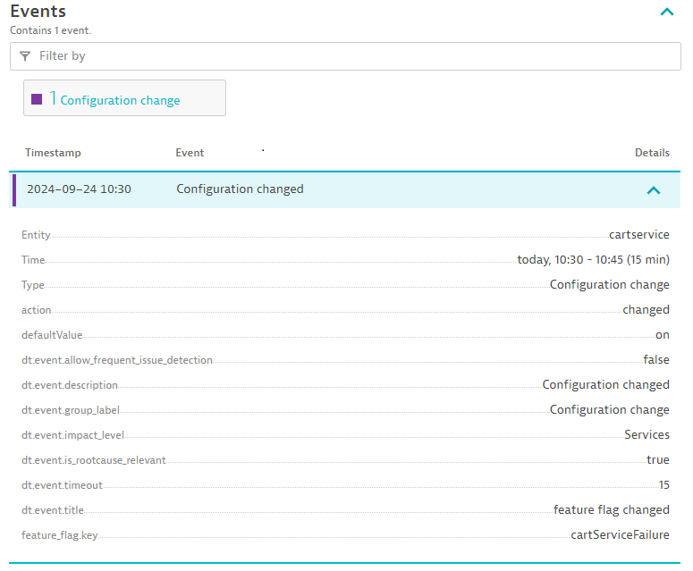

The application is running correctly. It is time to introduce a change into the system.

This simulates releasing new functionality to your users in production.

## Inform Dynatrace

First, inform Dynatrace that a change is about to occur.
Namely, you are going to make a change to the `my-otel-demo-cartservice` service 
by changing the `cartServiceFailure` feature flag from `off` to `on`.

Tell Dynatrace about the upcoming change by sending an event (note: This event does **not** actually make the change; you need to do this).

Run the following:

```
./runtimeChange.sh my-otel-demo-cartservice cartServiceFailure on
```

Refresh the `my-otel-demo-cartservice` page and near the bottom you should see the configuration change event.



## Make Change

Open this file: `flags.yaml`

Change the `defaultValue` of `cartServiceFailure` from `"off"` to `"on"` (scroll to line `75`)


Now apply the change by running this command:

```
kubectl apply -f $CODESPACE_VSCODE_FOLDER/flags.yaml
```

You should see:

```
configmap/my-otel-demo-flagd-config configured
```

!!! warning "Be Patient"
    The application will now generate errors when emptying the users cart.
    It will do this 1/10th of the time, so be patient, it can take a few moments for the errors to occur.

## Generate Your Own Traffic

There is a load generator running, but you can generate traffic by accessing the site.

See [access user interface](access-ui.md){target=_blank}

Repeatedly add an item to your cart, go to the cart and empty it. Hope you're "lucky" that you generate a backend failure.

## Open Problems App

In Dynatrace:

* Press `ctrl + k`. Search for `problems`
* Open the problems app

Wait for the problem to appear.

You can also open the `my-otel-demo-cartservice` Service screen to monitor for failures.

* Press `ctrl + k`. Search for `Services`
* Open the services app + navigate to the `my-otel-demo-cartservice`
* Monitor the `Failed requests` chart

<div class="grid cards" markdown>
- [Click Here to Continue :octicons-arrow-right-24:](review-problem.md)
</div>
