!!! tip
    Right click each image and "Open image in new tab" to see a larger version.

After a few moments, DAVIS will detect the issue and create a problem.

!!! question
    Let's see what Dynatrace can tell us about this issue...

Press `ctrl + k` and search for `Problems` this will open the problems screen.

You should see a problem titled: `Redis connection errors`

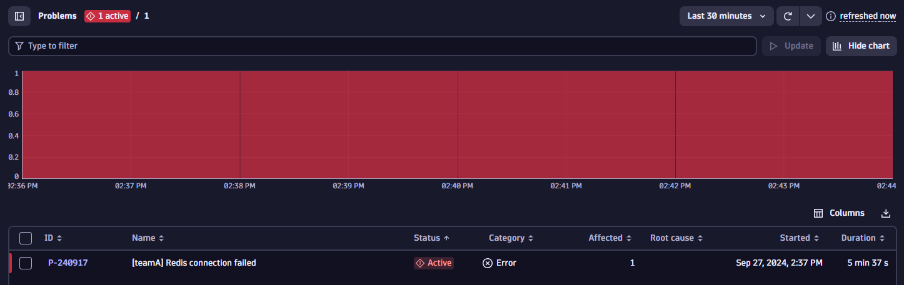

## Explore Problem Details

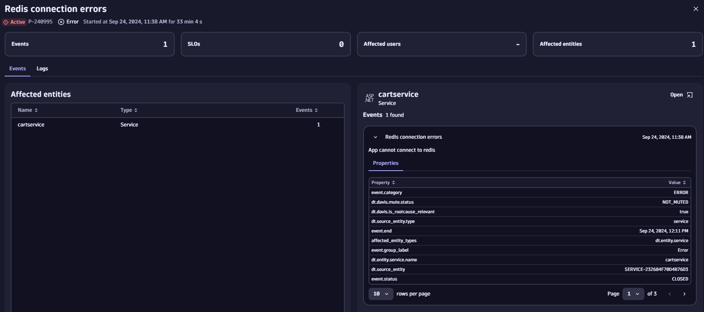

Opening the problem record, you will see that it has effected one entity: the `my-otel-demo-cartservice`.

Navigate to the `Logs` panel. Click `Run query` next to `Show x errors` (your number of errors may differ from the screenshot)

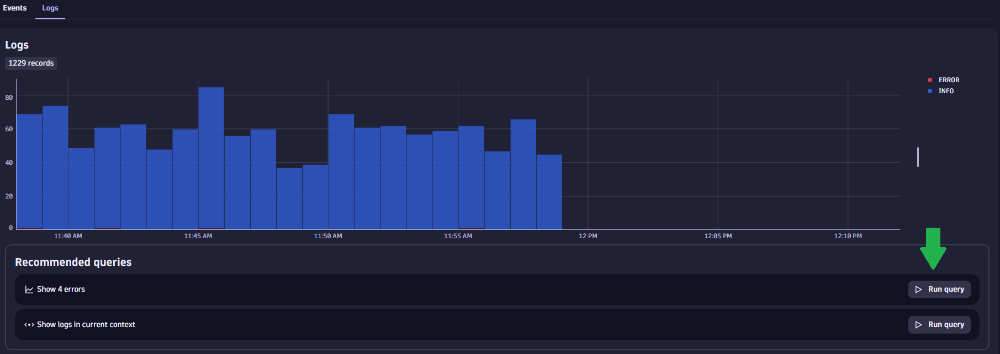

## Logs Contain Key Metadata

Expand the log entry and notice you have some key metadata available:

* Timestamp of this log line
* `host.name` (which equates to the container name)
* `loglevel` ie. `ERROR`
* OpenTelemetry `span_id` and `trace_id`
* Ownership information: `dt.owner`
* Cost information: `dt.cost.product` and `dt.cost.costcenter`

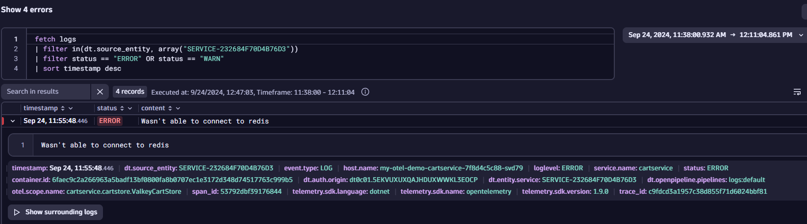

## What Happened Leading to this Error?

Now click `Show surrounding logs` this shows `ALL` log lines with the same `trace_id`.

You can also choose `based on topology` to see the error in context of all other logs on that service at the time of the error.

This means you can see precisely what led up to the failure. In this case:

* The system retrieved the cart contents
* A pricing quote was calculated
* The system performed a currency conversion
* The user requested to empty their cart
* The error occured whilst trying to empty the cart

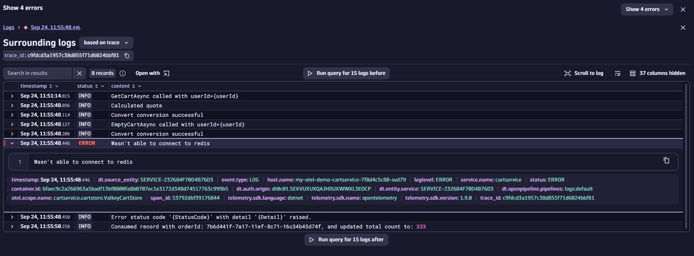

Notice that an Error status code and detailed message is also available:

* The `statuscode` is `FailedPrecondition`
* The `detail` provides an error message: `Can't access cart storage. System.ApplicationException: Wasn't able to connect to redis...`
* The `detail` field also provides a reference to the line of code (LOC) where this error occured.

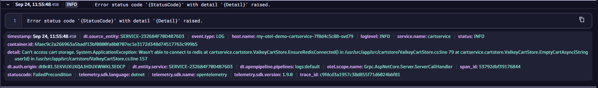

## Navigate from Log to Trace

In this demo application logs, spans and traces are all correctly instrumented with the `span_id` and `trace_id` field. Meaning logs can be correlated and linked to traces.

Let's navigate from the log line to the trace view to get a wider view of the error and what hte user was trying to do during this action.

* Click the value field of the `trace_id`. This should open the `Explore` context menu.
* Select `Open field with` (`open record with` also opens the trace but "jumps" you down the trace to the error location)
* Choose to open with the `Distributed traces` app

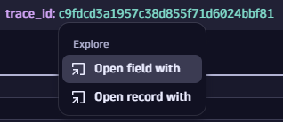
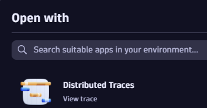

The trace view gives a deeper, more contextual view of what we've already seen from the logs.

The user tries to place an order, there are currency conversions and quotations occurring.
Finally the `EmptyCart` method is called, which fails.

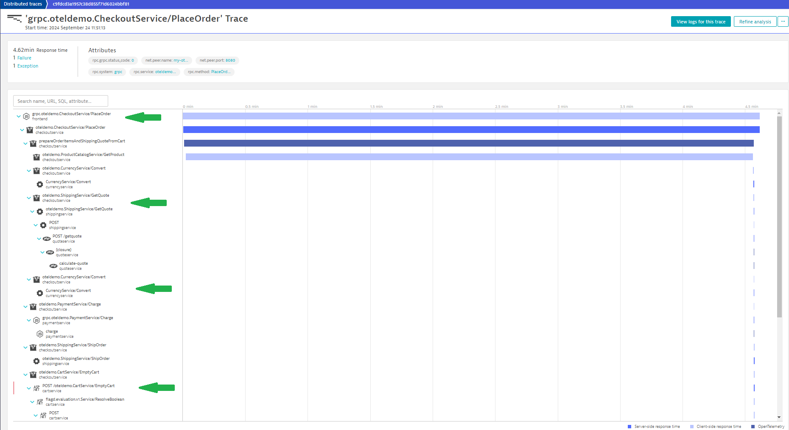

## Runbook! Where's the runbook!?

Recall that the developer provided us with a handy runbook.

Navigate back to the problem and notice the problem description contains a link to the Ops runbook.

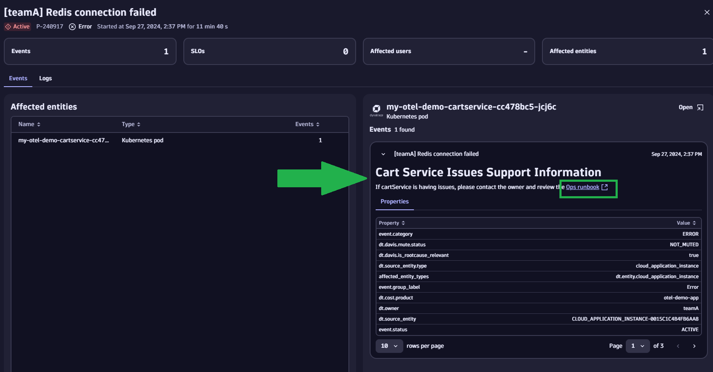

Follow the link to the runbook.

### Immediate Action

The first section of the runbook provides clear instructions on what to do and who to contact.

### Chart 1: Error Trend

!!! tip "Re-run sections"
    You may need to re-run the sections to refresh the data.
    Just click each chart and click the `Run` button

The first chart shows a increased failure rate for the `cartservice`.

OK, we're on to something...

DAVIS told us (and our investigation confirmed) that the problem originated in the `cartservice`.

We know that the problem was caused by a failure to connect to Redis. But what caused that error? Did something change?

### Chart 2: Change Caused the Failure

Chart two shows both configuration events and problems on the same chart.

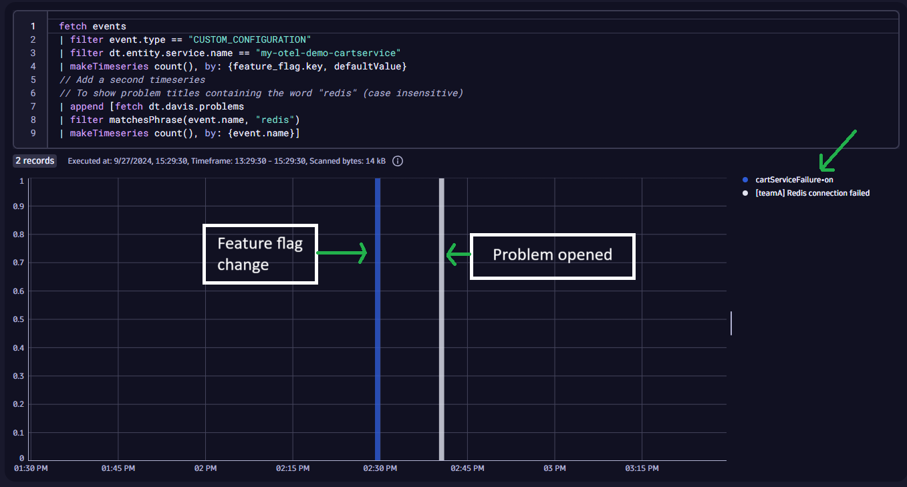

!!! tip "Change is the cause of most failures"
    Something changed on the `cartservice` immediately prior
    to an issue occuring.

    Thanks to the "configuration changed" event we have all necessary information to understand the true root cause.

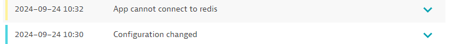
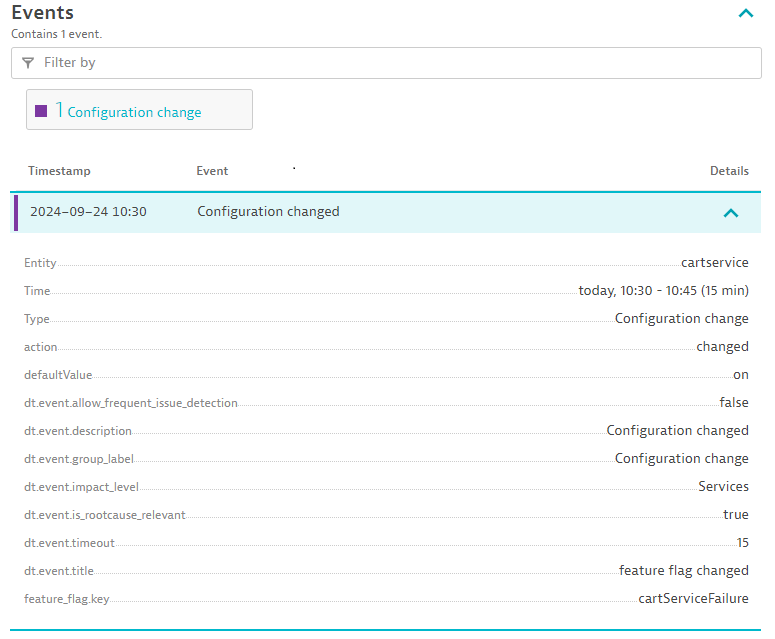

!!! success "🎉Congratulations 🎉"
    You have successfully completed this
    Observability Lab. Continue below to clean up your environment.

- [Click Here to Begin :octicons-arrow-right-24:](cleanup.md)

