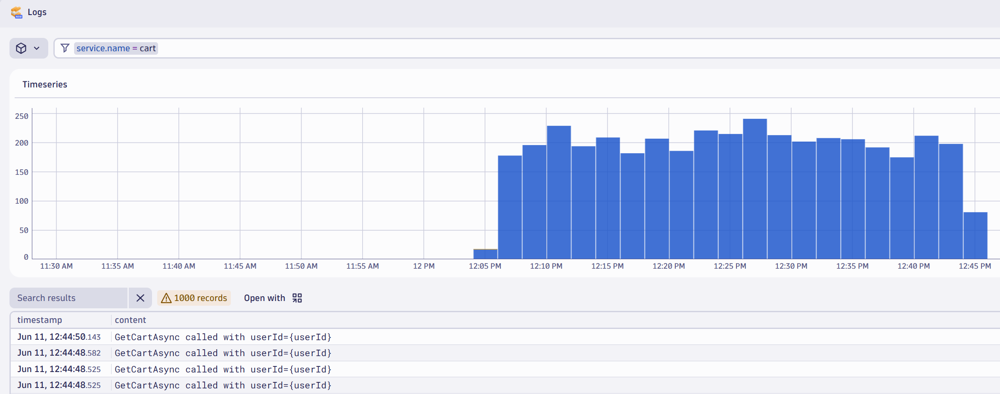
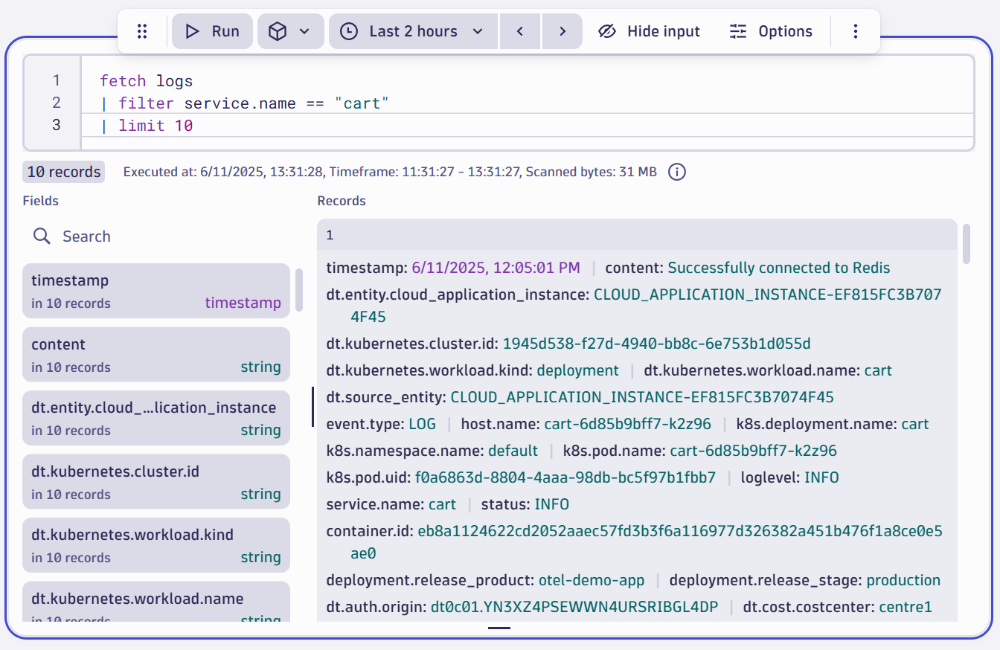

--8<-- "snippets/bizevent-validate-observability-data.js"

In Dynatrace, press `ctrl + k` and search for `Services`. Dynatrace creates service entities based on the incoming span data.
The logs are also available for [some services](https://opentelemetry.io/docs/demo/telemetry-features/log-coverage/){target=_blank}

In this demo, you will be focussing on the `Cart`  which does have logs and is written in `.NET`.

You can also query data via [notebooks](https://docs.dynatrace.com/docs/observe-and-explore/dashboards-and-notebooks/notebooks){target=_blank}
and [dashboards](https://docs.dynatrace.com/docs/observe-and-explore/dashboards-and-notebooks/dashboards-new){target=_blank} (`ctrl + k` and search for `notebooks` or `dashboards`).

For example, to validate logs are available for `cartservice`, use one of the following methods:

## Use the logs app
* Open the `logs` app.
* Click the `+` icon and add a filter for `service.name` with a value `cart`
* Run the query to see the latest `cart` service logs



## Use the notebooks app
* Open the `notebooks` app
* Add a Dynatrace Query Language (DQL) tile
* Use the following DQL query:

```
fetch logs
| filter service.name == "cart"
| limit 10
```



<div class="grid cards" markdown>
- [Click Here to Continue :octicons-arrow-right-24:](introduce-change.md)
</div>